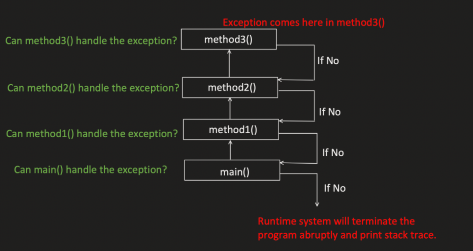

# Exception Handling

## Exception

- It's an event, that occurs during the execution of the program.
- It will disrupt your program normal flow.
- It creates the Exception Object, which contain information about the Error like
  - Exception Type
  - Exception Message
  - Stack trace etc.
- Runtime system use this Exception Object and find the class which can handle it.

### Exception Stack Flow




### Exception Hierarchy


## 1. Runtime Exception

- These are the exceptions which occurs during runtime and compiler not forcing us to handle them.

#### 1.1 ClassCastException

```java
public class Main{
    public static void main(String[] args){
        Object val = 0;
        System.out.println((String)val);
    }
}
```

> Exception in thread "main" **java.lang.ClassCastException** : java.lang.Integer cannot be cast to java.lang.String at Main.main(Main.java:8)

#### 1.2 ArithmeticException

```java
public class Main{
    public static void main(String[] args){
        int val = 5/0;
    }
}
```

> Exception in thread "main" **java.lang.ArithmeticException** : / by zero at Main.main(Main.java:5)

#### 1.3 IndexOutOfBoundException

```java
public class Main{
    public static void main(String[] args){
        int[] val = new int[2];
        System.out.println(val[3]);
    }
}
```

> Exception in thread "main" **java.lang.ArrayIndexOutOfBoundsException** : 3 at Main.main(Main.java:6)

- Similar to StringIndexOutOfBoundsException

#### 1.4 NullPointerException

```java
public class Main{
    public static void main(String[] args){
        String val = null
        System.out.println(val.charAt(0));
    }
}
```

> Exception in thread "main" **java.lang.NullPointerException** : at Main.main(Main.java:6)

#### 1.5 IllegalArgumentException

```java
public class Main{
    public static void main(String[] args){
        int val = Integer.parseInt("abc");
    }
}
```

> Exception in thread "main" java. lang. NumberFormatException Create breakpoint : For input string: "abc"
at java. lang. NumberFormatException. forInputString (NumberFormatException. java:65)
at java. lang. Integer.parseInt (Integer java:580)
at java. lang. Integer.parseInt (Integer java:615)
at Main.main (Main. java:5)

## Compile-Time Exception

- Compiler verifies them during the compile time of the code and if not handled properly, code compilation will fail.

1. ClassNotFoundException
2. InteruptedException
3. IOException
    - FilenotFoundException
    - EOFException
    - SocketException
4. SQLException

### Step1. Throw Exception

***`throw`*** keyword: => used to manually throw any new exception.

```java
public class Main {
    public static void main(String[] args) {
        method1();
    }

    public static void method1(){
        throw new ClassNotFoundException(); // CompileError as not handled
    }
}
```

### Step2. Pass Exception to Parent Method

***`throws`*** keyword: => tells that, the method MIGHT throw this exception (or might not), so please caller you handle it appropriately.

```java
public class Main {
    public static void main(String[] args) {
        method1(); // CompileError as not handled
    }

    public static void method1() throws ClassNotFoundException{
        throw new ClassNotFoundException();
    }
}
```

### Step3. Handling Exception

#### try/catch/finally

***`try`*** keyword:

- Try block specify the code which can throw exception.
- Try block is followed either by catch block of finally block.

***`catch`*** keyword:

- Catch block is used to catch all exception which can be thrown in the try block.
- Multiple catch block can be used but only one try/finally block.
- Catch block can only catch exception which can be thrown by try block.
- upper catch block exception should be child of lower catch block exception otherwise Compile error
- multiple exception is one catch block.
    ```java
    catch(ClassNoteFoundException | InterruptedException exp){ }
    ```

***`finally`*** keyword:

- Finally block will always get executed, either if you just return from try block or from catch block.
- possible flow: *try/catch/finally* or *try/catch/catch/finally* or *try/finally*.
- Mostly used for closing the object, adding logs etc.
- If JVM related issues like out of memory, system shut down or our processis forcefully killed. Then only finally block will not excecute.

Examples:

```java
public class Main {
    public static void main(String[] args) {
        method1();
    }

    public static void method1() {
        try{
            throw new ClassNotFoundException();
        }
        catch(ClassNotFoundException exceptionObject){
            // handle this exception scenario like logging
            exceptionObject.printStackTrace();
        }
    }
}
```

OR

```java
public class Main {
    public static void main(String[] args) {
        try{
            method1();
        }
        catch(ClassNotFoundException exceptionObject){
            // handle this exception scenario like logging
            exceptionObject.printStackTrace();
        }
    }

    public static void method1() throws ClassNotFoundException{
        throw new ClassNotFoundException();
    }
}
```

```java
public class Main {
    public static void main(String[] args) {
        try{
            method1();
        }
        catch(ClassNotFoundException exceptionObject){
            // handle this exception scenario like logging
            exceptionObject.printStackTrace();
            return;
        }
        finally{
            System.out.println("Finally block"); // will execute even if return in catch.
        }
    }

    public static void method1() throws ClassNotFoundException{
        throw new ClassNotFoundException();
    }
}
```

```java
public class Main
{
    public static void main(String[] args) {
        try{
            throw new ArithmeticException();
        }
        catch(Exception exp){
            System.out.println("Exception catched"); //will execute
            throw exp;
        }
        finally{
            System.out.println("Finally excecuted"); // finally will always execute.
        }
    }
}
```

Output:
Exception catched
Finally executed
