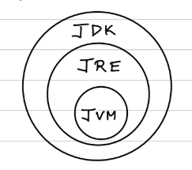
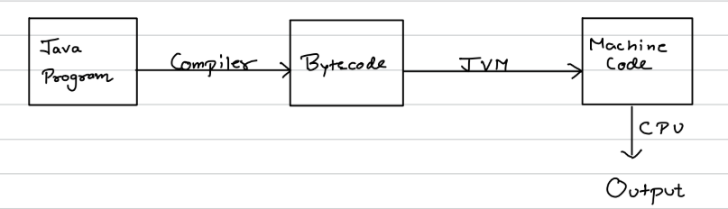
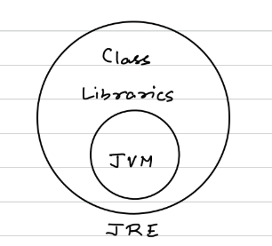

# JAVA Basics Overview

## What is Java?

- Platform Independent Language
- Java is a **statically-typed** language *(meaning the datatype must be define)*.
- Java is a **strongly-typed** language *(restriction on what values can be assigned to variables)*.
- Supports OOPS
- Portability (WORA): **Write Once, Run Anywhere**

## 3 Main Components of Java

---

### 1. JVM: Java Virtual Machine

- Abstract machine that doesn’t exist physically.

- JVM is **platform-dependent**, requiring installation specific to the OS (MacOS, Linux, Windows).
- Input: Bytecode, Output: Machine Code.
- Bytecode is **platform-independent**, making Java programs platform-independent.
- Internally JVM includes **JIT (Just-In-Time) Compiler** for converting bytecode to machine code at runtime(i.e only converting the parts of the program that are currently being executed thus improving execution speed).
- **AOT(Ahead of Time)** converts bytecode to machinecode before runtime(i.e during build).
- Starting from Java 9, Java offers hybrid model where both AOT and JIT can be used together.
  - AOT speeds up startup time and reduces memory usage, as the code is precompiled.
  - JIT optimizes performance during runtime based on actual usage patterns (code that are not precomlied or need to optimized further during execution)

> Read JIT vs AOT

---

### 2. JRE: Java Runtime Environment

- Contains **JVM** and **Class Libraries** *(libraries that is used in the code)*.

So, with **JRE**, we can run Java programs, but we **cannot code** programs.

---

### 3. JDK: Java Development Kit

- Contains tools and programs for Java development.  
- JDK = JRE + **Compiler** + **Debugger** + **Other Components**

> All three - **JVM**, **JRE**, and **JDK** are platform-dependent.
>
> However, compiled bytecode is platform-independent.

---

## Java Editions

1. **JSE**: Java Standard Edition
    - Core Java.
2. **JEE**: Java Enterprise Edition (Jakarta)
    - JSE + Servlets + JSP(Jakarta Server Pages) + Transaction API + Persistence API.
3. **JME**: Java Micro/Mobile Edition
    - API for mobile applications.
