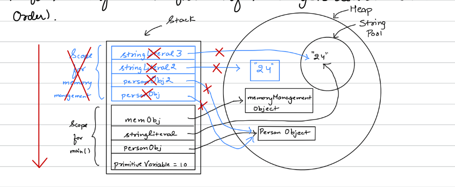

# Java Memory Management

Java creates and manages **Two types of memory** through the JVM:

1. **Stack**
2. **Heap**

---

### 1.  Stack Memory

- Stores temporary variables and has separate memory blocks for methods.
- Stores:
  - Primitive data types
  - References to heap objects:
    - Strong reference
    - Weak reference
    - Soft reference
- Each thread has its own stack memory.
- Variables are only visible within their scope and are deleted from the stack in **LIFO** order when they go out of scope.
- If the stack is full, a `java.lang.StackOverflowError` is thrown.

---

### 2. Heap Memory

- Stores objects with no specific allocation order.
- The **Garbage Collector (GC)** removes unreferenced objects from the heap using the **Mark and Sweep Algorithm**.
- Types of Garbage Collectors include:
  - Serial GC
  - Parallel GC
  - Concurrent Mark and Sweep (CMS)
  - G1 (Garbage-First)
- Heap memory is shared with all the threads.

---

### Flow of memory management

Illustration of heap, stack, and string pool with data types, objects, and references.

```java
public class MemoryManagement {
    public static void main(String args[]) {
        int primitiveVariable1 = 10; // primitve date type
        Person personObj = new Person() ; // object
        String stringLiteral = "24"; // string literal
        MemoryManagement memObj = new MemoryManagement();
        memObj.memoryManagementTest(personObj);
    }
    private void memoryManagementTest(Person personObj){
        Person person0bj2 = personObj ; // reference to object
        String stringLiteral2 = "24"; // Atring literal
        String stringLiteral3 = new String( original: "24");
    }
}
```

Initially after loading whole code in memory:


When a method completes, its stack frame is cleared, and memory is freed in **LIFO** order. Here`memoryManagementTest()` finishes, so its stack portion is deleted.


Now, `main()`'s stack portion is deleted.


Now, the entire stack is cleared


Now, Garbage Collector deletes all unreferenced objects from heap memory.


---

# Garbage Collector (GC)

- The GC runs periodically and manages heap memory automatically.
- JVM controls when to run the garbage collector, but you can request a GC run using `System.gc()`, but this is not guaranteed.

---

### Types of References

#### 1. **Strong Reference**

- Till the time the reference exists, GC won't be able to delete the object from the Heap Memory.
- Example
    ```java
    Person obj = new Person();
    ```
- The obj variable strongly references the Person object, preventing GC from deleting it.

#### 2. **Weak Reference**

- In weak reference also the reference exists to an object in the heap, but as soon as GC runs the object is deleted from heap memory even if some variable is referencing this object from the stack.
- The variable in the stack will get null, If it tries to access the object post GC run.
- Example:
    ```java
    WeakReference<Person> weakObj = new WeakReference<>(new Person());
    ```
- The weakObj allows GC to delete the Person object even if it’s referenced.

#### 3. **Soft Reference**

- Similar to weak references but the difference is that object will be deleted only when there is shortage of space in Heap.
- So GL is allowed to delete a soft reference but it'll keep the object if sufficient space is there in heap.

## Heap Memory Structure

Heap memory is divided into:

1. **Young Generation**
    - Contains Eden, S0, and S1 (survivor spaces).
2. **Old Generation**
3. **Metaspace** (non heap)
    - Stores class metadata, constants, and static variables.

> Before Java 8, PermGen was used, but it was non-expandable. Java 8 introduced Metaspace, which is expandable.

Objects are stored with ther age. New Objects comes in Eden and past objects Mark and Sweeps between survivor spaces. once.This whole process is called Minor GC as it happens very periodically & very fast.

Once survicor objects (from s0/s1) exceeds threshold age then it moves in Old Generation.

In the old generation only difference is that here it is called Major GC because the GC in Old Generation won't run too periodically as the objects in old gen are kind of big objects that are used too frequently and these might have a lot of references pointing to them.


## Garbage Collector Algorithms

1. Mark and Sweep:
    - Marks objects for deletion and removes them.

2. Mark and Sweep with Compact Memory:
    - Once GC runs, it moves surviving objects into a contiguous memory block to optimize space(leaving another sequential block free to put objects).

## Garbage Collector Versions

1. Serial GC:
    - In this only one GC thread is working for both minor and major GC.
    - It's disadvantage is that due to the single thread, GC will be slower but Since GC is expensive (because when GC work starts, all application threads pauses). So this is one of the disadvantages of serial.

2. Parallel GC:
    - In this there are parallel threads running based on the CPU configuration. So GC works faster, reducing application threads pause times.

3. Concurrent Mark and Sweep (CMS):
    - In this the GC will try its best for run concurrently with application threads but there is no guarantee. In this there is no memory compaction happens.

4. G1 GC:
    - Better version of CMS, in which GC will try not to stop/pause the application thread and supports memory compaction as well.

> Java 8 uses Parallel GC.
>
> Latest Java version uses G1 GC.
